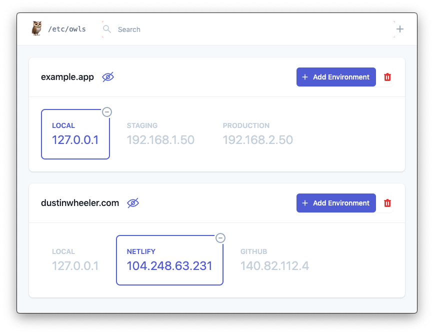

<h1 align="center">
  <br>
  <a href="https://github.com/mdwheele/owls"></a>
  <br>
  Owls
  <br>
</h1>

<h4 align="center">Easy management of /etc/hosts built on top of <a href="http://electron.atom.io" target="_blank">Electron</a>.</h4>

<p align="center">
  <a href="#key-features">Key Features</a> •
  <a href="#how-to-use">How To Use</a> •
  <a href="#download">Download</a> •
  <a href="#license">License</a>
</p>

<p align="center">
  
</p>

## Disclaimer :fire:

I'm actively developing this application, which means that if you don't trust me (you shouldn't), 
you should make backups of your host file before using this application in the circumstance that 🦉 deletes
everything.

You've been warned. On with the show.

## Key Features

* Use Projects for every hostname you're interested in tracking.
* Create Environments for your Projects which point at specific IP addresses.
* Automatic importing of current host files.
* Cross platform - Windows, macOS and Linux ready.
* Pretty as fuck.
* Easy to use, blah blah.

## How To Use

These instructions are most useful for those that want to run unreleased builds or to do development on Owls. If you would prefer to use a known working build, check out our [Download](#downloads) section.

To clone and run this application, you'll need [Git](https://git-scm.com) and [Node.js](https://nodejs.org/en/download/) (which comes with [npm](http://npmjs.com)) installed on your computer.

From your command line:

```bash
# Clone this repository
$ git clone https://github.com/mdwheele/owls

# Go into the repository
$ cd owls

# Install dependencies
$ npm install

# Run the app in developer mode
$ npm run electron:serve
```

## Download

We're currently providing `prerelease` builds that are notable releases of work-in-progress. Please keep in mind that these are not bulletproof builds and that there **will** be bugs. Please report any bugs you discover so we can work to get them resolved!

<p align="center">
  <a href="https://github.com/mdwheele/owls/releases">Releases</a>
</p>

## Emailware

Owls is an [emailware](https://en.wiktionary.org/wiki/emailware). Meaning, if you liked using this app or it has helped you in any way, I'd like you send me an email at <mdwheele@gmail.com> about anything you'd want to say about this software. I'd really appreciate it!

Of course, you can always leave :heart: on our [issue board](https://github.com/mdwheele/owls/issues/new).

## License

MIT

---

> GitHub [@mdwheele](https://github.com/mdwheele) &nbsp;&middot;&nbsp;
> Twitter [@mdwheele](https://twitter.com/mdwheele)

